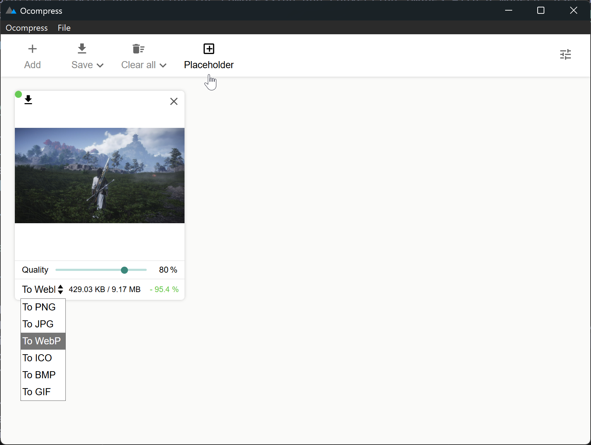

# Ocompress

A cross-platform desktop application for compressing and converting images with a modern, user-friendly GUI.
This is a re-write using Tauri and Svelte of the original [Imagine](https://github.com/meowtec/Imagine).

## Install

Download binaries for Windows, macOS, and Linux from:

[https://github.com/LoveIiei/Ocompress/releases]

| Platform | File |
|----------|------|
| Windows | `Ocompress-x.y.z.msi` or `Ocompress-x.y.z.exe` |
| macOS | `Ocompress-x.y.z.dmg` |

## Screenshot



## Features

- **Smallest executable size**: Thanks to Tauri framework
- **Little ram usage**: Efficient memory consumption, 20 times less than the original Electron version
- **Multi-format support**: PNG, JPEG, WebP, BMP, ICO, GIF
- **Format conversion**: Convert between any supported formats
- **Batch optimization**: Process multiple images concurrently
- **Drag and drop**: Drop files directly into the app
- **Real-time preview**: View original and optimized images side-by-side
- **Adjustable quality**: Fine-tune compression quality (10-100) and color palette (2-256)
- **Multiple save options**: Overwrite, save with new name, save to directory, or save as
- **Placeholder generation**: Create placeholder images with custom dimensions and colors
- **Cross-platform**: Windows, macOS, and Linux
- **Internationalization**: 15 languages supported
  - English, 简体中文, Deutsch, Español, Français, Italiano, Nederlands
  - العربية, فارسی, Hrvatski, Polski, Русский, Srpski, Svenska

## Development

### Prerequisites

- [Node.js](https://nodejs.org/) (v18+)
- [Rust](https://www.rust-lang.org/tools/install)
- [Tauri CLI](https://tauri.app/v1/guides/getting-started/prerequisites)

### Setup

```bash
git clone https://github.com/LoveIiei/Ocompress.git
cd Imagine
npm install
```

### Commands

| Command | Description |
|---------|-------------|
| `npm run dev` | Start development environment (Tauri + Vite) |
| `npm run build` | Build production desktop application |
| `npm run test` | Run linting and tests |
| `npm run lint` | TypeScript check + ESLint validation |

### Project Structure

```
├── modules/                 # Frontend source (Svelte + TypeScript)
│   ├── renderer/           # UI components and stores
│   ├── bridge/             # Frontend-backend communication
│   ├── common/             # Shared types and utilities
│   └── locales/            # i18n translations
├── src-tauri/              # Backend source (Rust)
│   ├── src/                # Rust source code
│   └── bin/                # Platform-specific compression binaries
└── dist/                   # Build output
```

## Contributing

Pull requests are welcome! Before submitting:

1. Run `npm run test` and ensure all checks pass
2. Follow existing code style and conventions

### Adding a New Locale

Locale files are in [`modules/locales/`](./modules/locales/). To add a new language:

1. Create a new file (e.g., `ja.ts`) based on `en.ts`
2. Add the export to `modules/locales/index.ts`
3. Submit a PR

Alternatively, [create an issue](https://github.com/LoveIiei/Ocompress/issues/new) or contact the maintainer.

## Built With

### Image Compression

- [pngquant](https://pngquant.org/) - Lossy PNG compressor
- [mozjpeg](https://github.com/mozilla/mozjpeg) - Improved JPEG encoder
- [cwebp](https://developers.google.com/speed/webp/) - WebP encoder

### Application Framework

- [Tauri](https://tauri.app/) - Cross-platform desktop framework
- [Svelte](https://svelte.dev/) - Frontend framework
- [Vite](https://vitejs.dev/) - Build tool
- [Rust](https://www.rust-lang.org/) - Backend language

## License

MIT
